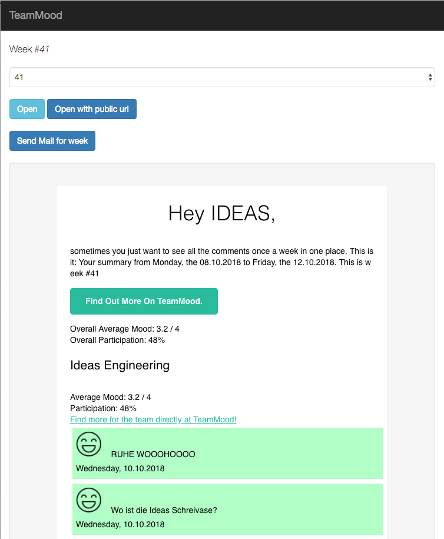
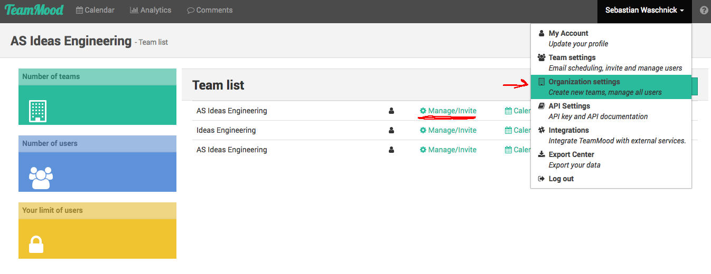
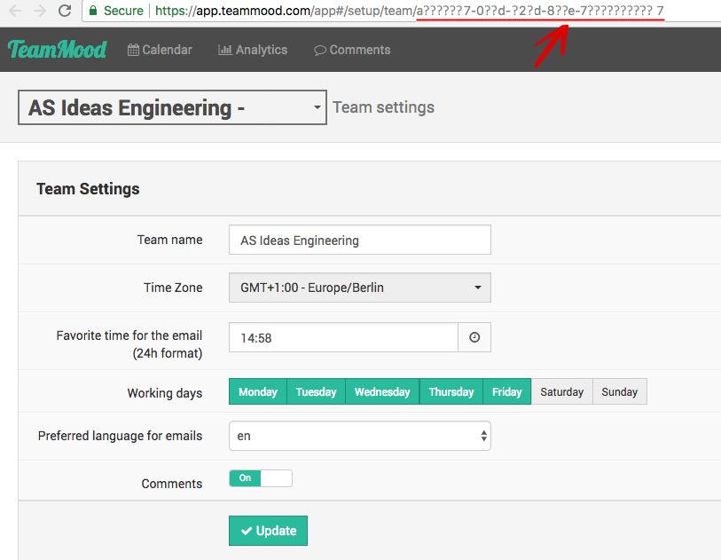

# ideas-teammood: Weekly TeamMood e-mail

HINT: The e-mails are currently manually triggered over the ui, as our german workers council demands manually scanning all comments before sending such mails.

### Prerequisites

* TeamMood-Account
* ElasticMail-Account 

### Starting the app

* HINT: There is a ``Procfile`` for easy hosting on Heroku, you only need to add the 4 properties at your Heroku-Settings
* starts locally and connect to ``http://localhost:4567``
> java -jar -Dde.axelspringer.ideas.team.mood.mail.user={USER} -Dde.axelspringer.ideas.team.mood.mail.password={PASSWORD} -Dde.axelspringer.ideas.team.mood.api.keys={KEY}

### Properties

* ``de.axelspringer.ideas.team.mood.elasticMailApiKey`` The API key of your ElasticMail account
* ``de.axelspringer.ideas.team.mood.email.addresses`` The e-mail addresses which will receive the summary mail (comma separated)
* ``de.axelspringer.ideas.team.mood.api.keys`` The TeamMood teams as UUIDs from where the moods should be included in the mail (comma separated)
* ``de.axelspringer.ideas.team.mood.api.apiUsername`` Your TeamMood API Username, found under the TeamMood API settings. 
* ``de.axelspringer.ideas.team.mood.api.apiPassword`` The TeamMood API Password, found under the TeamMood API settings.

* ``de.axelspringer.ideas.team.mood.basicAuthPassword`` The basic auth password to secure this webapp. If empty the basic auth will be disabled. The username is always **ideas**

Example:
> -Dde.axelspringer.ideas.team.mood.api.keys=a??????7-xxx-xxxx-xxxx-77a4fed63a57,01770399-xxx-xxxx-xxxx-c96e0dc90e58,103ceac8-xxx-xxxx-xxxx-f0e912cddaa7 -Dde.axelspringer.ideas.team.mood.elasticMailApiKey=d2ca56f3-xxx-xxxx-xxxx-ef6a24368788 -Dde.axelspringer.ideas.team.mood.email.addresses=hello@asideas.de

### How to get your TeamMood-API Keys

* Each team has an unique API-Key
    * Login to TeamMood
    * Click on your name in the right upper corner
    * Select "Organization settings"
    * Click on "Manage/Invite" 
    * The UUID of the team is found in the URL

## Source/Links

#### E-Mail Template 
https://github.com/leemunroe/responsive-html-email-template

#### Let's Encrypt

TeamMood uses Let's Encrypt certificates, which may cause trouble with older Java-Versions. For this app it is already fixed.

cf. http://blog.novoj.net/2016/02/29/how-to-make-apache-httpclient-trust-lets-encrypt-certificate-authority/

keytool -keystore letsencrypt-truststore -alias isrgrootx -importcert -file letsencrypt.cer
keytool -keystore letsencrypt-truststore -alias identrust -importcert -file identrust.cer

##  License

Licensed under the Apache License, Version 2.0 (the "License") http://www.apache.org/licenses/LICENSE-2.0